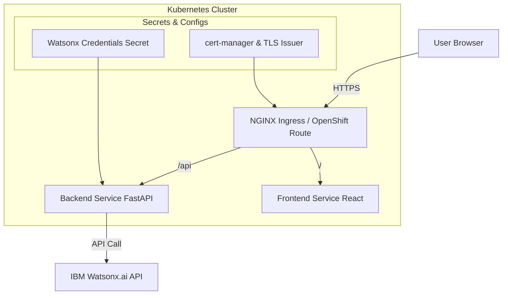

# How to Create a Production-Ready Watsonx.ai Chatbot in React & Python with Kubernetes and Let's Encrypt
Hello everyone, today we are goint to build a simple Chatbot with **Watsonx.ai** ready for production
in Kubernetes. 

Welcome to this comprehensive guide where we will build a sleek, secure, and scalable chatbot powered by **IBM's Watsonx.ai**. This tutorial goes beyond a simple proof-of-concept to deliver a production-grade solution.

We will walk through every step:

1.  **Project Structuring**: Organize the code into distinct `frontend` and `backend` services.
2.  **Modern Frontend**: Scaffold a **React** chatbot with Vite, styled beautifully with **Tailwind CSS**.
3.  **Robust Backend**: Create a secure **FastAPI** (Python) server to interact with the Watsonx.ai API.
4.  **Containerization**: Build optimized, secure Docker images for both services.
5.  **Kubernetes/OpenShift Deployment**: Deploy the entire application to a Kubernetes cluster, with specific guidance for OpenShift.
6.  **Automated SSL**: Secure the application with a free **Let's Encrypt** TLS certificate, automatically managed and renewed by **cert-manager**.

The final architecture is GitOps-friendly, promoting modern CI/CD practices.





### Final Application Preview

Here's a sneak peek of our good-looking chatbot interface:

## 0\. Prerequisites

Before we begin, ensure you have the following installed and configured:

  * **Node.js ≥ 18** and **npm**
  * **Python ≥ 3.9**
  * **Docker** and a container registry (like Docker Hub, Quay.io, or a private registry).
  * A **Kubernetes cluster** with `kubectl` configured. An OpenShift cluster will also work perfectly.
  * **Helm** (the Kubernetes package manager) for installing cert-manager.
  * A public **hostname** pointing to your cluster's Ingress controller. We will use an example domain like `chatbot.c130-e.us-south.containers.cloud.ibm.com`.
    > **Important**: In all subsequent steps, replace `YOUR_REGISTRY` with your container registry path and `chatbot.c130-e.us-south.containers.cloud.ibm.com` with your actual public hostname.

<details> <summary><strong>install.sh</strong>  Development Environment Installer for Ubuntu 22.04</summary>

```bash
#!/usr/bin/env bash
#
# install.sh - Comprehensive Development Environment Installer for Ubuntu 22.04
#
# This script installs:
# - Common utilities (curl, gnupg, etc.)
# - Python 3.11
# - Node.js v20 & npm
# - Docker Engine & Docker Compose
# - kubectl (Kubernetes CLI)
# - Helm (Kubernetes Package Manager)
# - oc (OpenShift CLI) - Optional

set -euo pipefail
IFS=$'\n\t'

# --- HELPERS ---
log() {
    echo -e "\n[$(date +'%Y-%m-%d %H:%M:%S')] - $1"
}

# --- CONFIGURATION ---
K8S_STABLE_VERSION="v1.30" # Target Kubernetes minor version. Verify at https://kubernetes.io/releases/

# --- INSTALLATION FUNCTIONS ---

install_base_prereqs() {
    log "⚙️ Updating package lists and installing base prerequisites..."
    sudo apt-get update -y
    sudo apt-get install -y curl ca-certificates gnupg apt-transport-https software-properties-common
    log "✅ Base prerequisites installed."
}

install_python() {
    log "🐍 Installing Python 3.11..."
    if command -v python3.11 &>/dev/null; then
        log "✅ Python 3.11 is already installed."
        python3.11 --version
        return
    fi
    sudo add-apt-repository ppa:deadsnakes/ppa -y
    sudo apt-get update -y
    sudo apt-get install -y python3.11 python3.11-venv python3.11-dev python3-pip
    log "✅ Python 3.11 installed."
    python3.11 --version
}

install_node() {
    log "📦 Installing Node.js (v20.x) and npm..."
    if command -v node &>/dev/null && [[ "$(node -v)" == v20* ]]; then
        log "✅ Node.js v20 is already installed."
        node -v
        npm -v
        return
    fi
    # Add NodeSource repository
    curl -fsSL https://deb.nodesource.com/setup_20.x | sudo -E bash -
    sudo apt-get install -y nodejs
    log "✅ Node.js and npm installed."
    node -v
    npm -v
}

install_docker() {
    log "🐳 Installing Docker Engine and Docker Compose..."
    if command -v docker &>/dev/null; then
        log "✅ Docker is already installed."
        docker --version
        return
    fi
    # Add Docker's official GPG key
    sudo install -m 0755 -d /etc/apt/keyrings
    sudo rm -f /etc/apt/keyrings/docker.gpg
    curl -fsSL https://download.docker.com/linux/ubuntu/gpg | sudo gpg --dearmor -o /etc/apt/keyrings/docker.gpg
    sudo chmod a+r /etc/apt/keyrings/docker.gpg

    # Add the repository to Apt sources
    echo \
      "deb [arch=$(dpkg --print-architecture) signed-by=/etc/apt/keyrings/docker.gpg] https://download.docker.com/linux/ubuntu \
      $(. /etc/os-release && echo "$VERSION_CODENAME") stable" | \
      sudo tee /etc/apt/sources.list.d/docker.list > /dev/null
    sudo apt-get update -y

    # Install the latest version
    sudo apt-get install -y docker-ce docker-ce-cli containerd.io docker-buildx-plugin docker-compose-plugin

    # Add current user to the 'docker' group
    log "🔧 Adding current user ($USER) to the 'docker' group..."
    sudo groupadd --force docker
    sudo usermod -aG docker "$USER"
    
    log "✅ Docker installed successfully."
    log "⚠️ IMPORTANT: You must log out and log back in for the Docker group changes to take effect!"
}

install_kubectl() {
    log "☸️ Installing kubectl (target: $K8S_STABLE_VERSION)..."
    
    # Clean old k8s repos
    log "🧹 Cleaning up old Kubernetes repository configurations..."
    sudo rm -f /etc/apt/sources.list.d/kubernetes*.list
    sudo sed -i.bak -E '/(packages\.cloud\.google\.com\/apt|apt\.kubernetes\.io)/d' \
      /etc/apt/sources.list.d/*.list /etc/apt/sources.list 2>/dev/null || true

    # Add new key for pkgs.k8s.io
    log "🔑 Adding new Kubernetes GPG key..."
    sudo mkdir -p /etc/apt/keyrings
    sudo rm -f /etc/apt/keyrings/kubernetes-apt-keyring.gpg
    curl -fsSL "https://pkgs.k8s.io/core:/stable:/$K8S_STABLE_VERSION/deb/Release.key" \
      | sudo gpg --dearmor -o /etc/apt/keyrings/kubernetes-apt-keyring.gpg
    sudo chmod a+r /etc/apt/keyrings/kubernetes-apt-keyring.gpg

    # Add new repo for pkgs.k8s.io
    log "📝 Adding new Kubernetes APT repository..."
    echo "deb [signed-by=/etc/apt/keyrings/kubernetes-apt-keyring.gpg] https://pkgs.k8s.io/core:/stable:/$K8S_STABLE_VERSION/deb/ /" \
      | sudo tee /etc/apt/sources.list.d/kubernetes.list

    # Install kubectl
    log "⬇️ Updating package lists and installing kubectl..."
    sudo apt-get update -y
    sudo apt-get install -y kubectl
    
    log "✅ kubectl installed."
    kubectl version --client
}

install_helm() {
    log "🚀 Installing Helm..."
    if command -v helm &>/dev/null; then
        log "✅ Helm is already installed."
        helm version
        return
    fi
    curl https://raw.githubusercontent.com/helm/helm/main/scripts/get-helm-3 | bash
    log "✅ Helm installed."
    helm version
}

install_oc() {
    log "🅾️ Installing OpenShift CLI (oc)..."
    if command -v oc &>/dev/null; then
        log "✅ OpenShift CLI is already installed."
        oc version --client
        return
    fi
    local OC_URL="https://mirror.openshift.com/pub/openshift-v4/clients/oc/latest/linux/oc.tar.gz"
    
    log "🔄 Downloading oc CLI from: $OC_URL"
    curl -Lo oc.tar.gz "$OC_URL"
    
    log "📦 Extracting oc.tar.gz..."
    tar -xvzf oc.tar.gz
    
    log "🚚 Moving oc binary to /usr/local/bin..."
    sudo mv oc /usr/local/bin/
    
    log "🧹 Cleaning up..."
    rm -f oc.tar.gz
    rm -f README.md || true
    
    log "✅ Verifying oc installation..."
    oc version --client
    log "🎉 'oc' CLI installed successfully!"
}


# --- MAIN EXECUTION ---
main() {
    log "🚀 Starting Development Environment Setup for Ubuntu 22.04 🚀"
    
    install_base_prereqs
    install_python
    install_node
    install_docker
    install_kubectl
    install_helm

    echo
    read -p "🤔 Do you want to install the OpenShift CLI (oc)? [y/N] " -n 1 -r
    echo
    if [[ $REPLY =~ ^[Yy]$ ]]; then
        install_oc
    else
        log "⏩ Skipping OpenShift CLI installation."
    fi

    log "🎉🎉🎉 --- ALL DONE! --- 🎉🎉🎉"
    log "Your development environment is ready."
    log "⚠️ REMINDER: Please log out and log back in to use Docker without 'sudo'."
}

# --- WRAPPER FOR USER ---
# The <details> block is for display purposes in certain environments.
# To run this script, save it as 'install.sh', then execute:
# chmod +x install.sh
# ./install.sh
# 
# <details> <summary><strong>install.sh</strong> Client Develop Enviroment</summary>
# ```bash
# # (The entire script content goes here)
# ```
# </details>

main "$@"
```
</details>


## 1\. Project Structure

A clean project structure is key for maintainability. We'll separate the frontend and backend into their own directories.

```text
watsonx-chatbot/
├── backend/
│   ├── main.py             # FastAPI server logic
│   ├── requirements.txt    # Python dependencies
│   └── Dockerfile          # Backend Docker image
├── frontend/
│   ├── public/
│   │   └── index.html
│   ├── src/
│   │   ├── components/       # Reusable React components (optional)
│   │   ├── services/
│   │   │   └── watsonx.js    # API call logic
│   │   ├── App.jsx           # Main application component
│   │   ├── index.css         # Tailwind CSS styles
│   │   └── index.jsx         # React entry point
│   ├── .env.example
│   ├── Dockerfile          # Frontend Docker image (multi-stage)
│   ├── package.json
│   ├── postcss.config.js   # PostCSS config for Tailwind
│   ├── tailwind.config.js  # Tailwind CSS config
│   └── vite.config.js      # Vite build tool config
└── k8s/
    ├── namespace.yaml
    ├── backend-deployment.yaml
    ├── backend-service.yaml
    ├── frontend-deployment.yaml
    ├── frontend-service.yaml
    ├── ingress.yaml
    ├── route-openshift.yaml # (Optional) OpenShift Route
    ├── cluster-issuer.yaml
    └── watsonx-secret.yaml
```


## 2. The FastAPI Backend (`backend/`)

Let's start by building the backend service that will securely handle communication with the Watsonx.ai API.

### Step 2.1: Create Backend Files

In the `backend/` directory, create the following files.

<details>
<summary><strong>backend/requirements.txt</strong></summary>

```text
fastapi
uvicorn[standard]
ibm-watsonx-ai>=2.1.2
python-dotenv
# For handling environment variables gracefully
python-decouple
```

</details>

<details>
<summary><strong>backend/main.py</strong> - Enhanced with CORS, Health Check, and Error Handling</summary>

```python
import os
from fastapi import FastAPI, HTTPException, Request
from fastapi.responses import JSONResponse
from fastapi.middleware.cors import CORSMiddleware
from pydantic import BaseModel
from ibm_watsonx_ai import WatsonXAI
from decouple import config

# --- Environment Variable Loading ---
# We use decouple to safely load credentials from environment variables.
# These will be provided by the Kubernetes Secret.
APIKEY = config("WATSONX_APIKEY", default=None)
URL = config("WATSONX_URL", default="https://us-south.ml.cloud.ibm.com")
PROJECT_ID = config("WATSONX_PROJECT_ID", default=None)

# --- Sanity Check ---
# Ensure essential variables are loaded.
if not (APIKEY and PROJECT_ID):
    raise RuntimeError("Missing required WatsonX environment variables (WATSONX_APIKEY, WATSONX_PROJECT_ID)")

# --- Watsonx.ai Client Initialization ---
try:
    svc = WatsonXAI.new_instance(
        version="2024-05-31",  # Use a recent, stable version
        service_url=URL,
        apikey=APIKEY
    )
except Exception as e:
    # Catch potential initialization errors
    raise RuntimeError(f"Failed to initialize WatsonXAI client: {e}") from e

# --- FastAPI Application ---
app = FastAPI(
    title="Watsonx Chat Backend",
    description="A secure backend to proxy requests to the IBM Watsonx.ai API.",
    version="1.0.0",
)

# --- CORS Middleware ---
# Allow requests from our frontend's domain.
# In a real production scenario, you would restrict this to your specific frontend URL.
app.add_middleware(
    CORSMiddleware,
    allow_origins=["*"],  # For simplicity. Restrict this in production!
    allow_credentials=True,
    allow_methods=["GET", "POST"],
    allow_headers=["*"],
)

# --- Pydantic Models for Type Safety ---
class ChatRequest(BaseModel):
    message: str

class ChatResponse(BaseModel):
    reply: str

# --- API Endpoints ---
@app.get("/", tags=["Health Check"])
async def read_root():
    """A simple health check endpoint."""
    return {"status": "ok", "message": "Watsonx Chat Backend is running."}

@app.post("/api/chat", response_model=ChatResponse, tags=["Chat"])
async def chat(req: ChatRequest):
    """
    Receives user input, sends it to Watsonx.ai, and returns the model's reply.
    """
    try:
        # Define model parameters
        params = {
            "decoding_method": "greedy",
            "max_new_tokens": 200,
            "min_new_tokens": 1,
            "repetition_penalty": 1.05,
        }

        # Call the Watsonx.ai service
        res = svc.generate_text(
            model_id="ibm/granite-13b-chat-v2",
            input=req.message,
            project_id=PROJECT_ID,
            parameters=params
        )

        # Extract the generated text
        reply = res.get_result()["results"][0]["generated_text"]
        return ChatResponse(reply=reply.strip())

    except Exception as e:
        print(f"An error occurred: {e}")
        raise HTTPException(status_code=500, detail="An internal error occurred while processing the request.")
```

</details>


<details>
<summary><strong>backend/Dockerfile</strong> - Secure and Optimized</summary>

> **Security Note**: This Dockerfile **does not** copy any `.env` file or secrets into the image. Credentials will be injected at runtime in Kubernetes, which is the correct and secure practice.

```dockerfile
# --- Build Stage ---
FROM python:3.11-slim AS builder

WORKDIR /app

# Install build dependencies
RUN pip install --no-cache-dir poetry

# Copy only necessary files to leverage Docker cache
COPY requirements.txt pyproject.toml* poetry.lock* ./

# Install dependencies
RUN pip install --no-cache-dir -r requirements.txt


# --- Final Stage ---
FROM python:3.11-slim

WORKDIR /app

# Create a non-root user for security
RUN useradd --create-home appuser
USER appuser

# Copy installed packages from the builder stage
COPY --from=builder /usr/local/lib/python3.11/site-packages /usr/local/lib/python3.11/site-packages
COPY --from=builder /app/requirements.txt .

# Copy application code
COPY main.py .

# Expose the port the app runs on
EXPOSE 8000

# Command to run the application
# We use Gunicorn for a more production-ready server than uvicorn's dev server.
CMD ["uvicorn", "main:app", "--host", "0.0.0.0", "--port", "8000"]
```

</details>


## 3\. The React Frontend (`frontend/`)

Now, let's build the user-facing chat interface.

### Step 3.1: Scaffold the React App and Install Dependencies

```bash
# Create the project directory and navigate into it
mkdir -p watsonx-chatbot/frontend && cd watsonx-chatbot/frontend

# Scaffold a new React app with Vite
npx create-vite@latest . --template react

# Install dependencies for styling and API calls
npm install tailwindcss postcss autoprefixer
npm install --save-dev vite-plugin-basic-ssl

# Initialize Tailwind CSS
npx tailwindcss init -p
```

### Step 3.2: Configure Frontend Files

Update the generated files and create new ones as shown below.


<details>
<summary><strong>frontend/tailwind.config.js</strong></summary>

```js
/** @type {import('tailwindcss').Config} */
export default {
  content: [
    "./index.html",
    "./src/**/*.{js,ts,jsx,tsx}",
  ],
  theme: {
    extend: {},
  },
  plugins: [],
}
```

</details>

<details>
<summary><strong>frontend/src/index.css</strong></summary>

```css
@tailwind base;
@tailwind components;
@tailwind utilities;

body {
  @apply bg-gray-50 dark:bg-gray-900;
}
```

</details>


<details>
<summary><strong>frontend/.env.example</strong></summary>

```dotenv
# This URL will be used by the local dev server.
# In Kubernetes, the frontend will call the backend via a relative path (/api/chat).
VITE_BACKEND_URL=http://localhost:8000
```

</details>


<details>
<summary><strong>frontend/vite.config.js</strong> (For local SSL development)</summary>

```js
import { defineConfig } from 'vite';
import react from '@vitejs/plugin-react';
import basicSsl from 'vite-plugin-basic-ssl';

export default defineConfig({
  plugins: [react(), basicSsl()],
  server: {
    // This allows the frontend dev server to proxy requests to the backend
    proxy: {
      '/api': {
        target: 'http://127.0.0.1:8000',
        changeOrigin: true,
        secure: false,
      },
    },
  },
});
```

</details>


<details>
<summary><strong>frontend/src/services/watsonx.js</strong> (API Logic)</summary>

```javascript
// A thin wrapper that calls our FastAPI backend
export async function chatWithWatson(userInput) {
  // During local development, Vite's proxy will handle this.
  // In production (Kubernetes), this will resolve to the same host,
  // routed by the Ingress to the backend service.
  const apiUrl = `/api/chat`;

  const response = await fetch(apiUrl, {
    method: 'POST',
    headers: { 'Content-Type': 'application/json' },
    body: JSON.stringify({ message: userInput })
  });

  if (!response.ok) {
    const errorBody = await response.json();
    throw new Error(errorBody.detail || 'Failed to get a response from the backend.');
  }

  const { reply } = await response.json();
  return reply;
}
```

</details>


<details>
<summary><strong>frontend/src/App.jsx</strong> - The Chat UI Component</summary>

```jsx
import { useState, useRef, useEffect } from 'react';
import { chatWithWatson } from './services/watsonx';

// Simple SVG icon for the send button
const SendIcon = () => (
  <svg viewBox="0 0 24 24" className="w-6 h-6 text-white" fill="currentColor">
    <path d="M2.01 21L23 12 2.01 3 2 10l15 2-15 2z" />
  </svg>
);

const UserAvatar = () => <div className="w-8 h-8 rounded-full bg-blue-500 flex-shrink-0" />;
const BotAvatar = () => <div className="w-8 h-8 rounded-full bg-indigo-500 flex-shrink-0" />;

const Message = ({ from, text }) => {
  const isUser = from === 'user';
  return (
    <div className={`flex items-start gap-3 my-4 ${isUser ? 'flex-row-reverse' : ''}`}>
      {isUser ? <UserAvatar /> : <BotAvatar />}
      <div
        className={`px-4 py-3 rounded-lg max-w-sm ${
          isUser ? 'bg-blue-100 text-gray-800' : 'bg-gray-200 text-gray-800'
        }`}
      >
        <p className="text-sm">{text}</p>
      </div>
    </div>
  );
};

export default function App() {
  const [messages, setMessages] = useState([
    {
      from: 'bot',
      text: 'Hello! I am a chatbot powered by Watsonx.ai. How can I assist you today?',
    },
  ]);
  const [input, setInput] = useState('');
  const [isLoading, setIsLoading] = useState(false);
  const messagesEndRef = useRef(null);

  const scrollToBottom = () => {
    messagesEndRef.current?.scrollIntoView({ behavior: 'smooth' });
  };

  useEffect(scrollToBottom, [messages]);

  const handleSend = async () => {
    if (!input.trim() || isLoading) return;

    const userMessage = { from: 'user', text: input };
    setMessages((prev) => [...prev, userMessage]);
    setInput('');
    setIsLoading(true);

    try {
      const reply = await chatWithWatson(userMessage.text);
      setMessages((prev) => [...prev, { from: 'bot', text: reply }]);
    } catch (error) {
      console.error(error);
      setMessages((prev) => [
        ...prev,
        { from: 'bot', text: `⚠️ Error: ${error.message}` },
      ]);
    } finally {
      setIsLoading(false);
    }
  };

  return (
    <div className="flex flex-col h-screen bg-gray-100">
      <header className="bg-white shadow-md p-4">
        <h1 className="text-2xl font-bold text-gray-800 text-center">
          Watsonx.ai Chatbot
        </h1>
      </header>

      <main className="flex-1 overflow-y-auto p-4 md:p-6">
        <div className="max-w-3xl mx-auto">
          {messages.map((m, i) => (
            <Message key={i} from={m.from} text={m.text} />
          ))}
          {isLoading && <Message from="bot" text="..." />}
          <div ref={messagesEndRef} />
        </div>
      </main>

      <footer className="bg-white p-4">
        <div className="max-w-3xl mx-auto flex items-center gap-3">
          <input
            className="flex-grow border rounded-full px-4 py-2 focus:outline-none focus:ring-2 focus:ring-blue-500"
            placeholder="Type a message…"
            value={input}
            onChange={(e) => setInput(e.target.value)}
            onKeyDown={(e) => e.key === 'Enter' && handleSend()}
            disabled={isLoading}
          />
          <button
            className="p-3 bg-blue-600 text-white rounded-full hover:bg-blue-700 disabled:bg-blue-300 transition-colors"
            onClick={handleSend}
            disabled={isLoading}
          >
            <SendIcon />
          </button>
        </div>
      </footer>
    </div>
  );
}
```

</details>


### Step 3.3: Create Frontend Dockerfile

This multi-stage Dockerfile first builds the static React assets and then serves them using a lightweight Nginx server, resulting in a small and secure final image.


<details>
<summary><strong>frontend/Dockerfile</strong> - Multi-stage Production Build</summary>

```dockerfile
# --- Stage 1: Build ---
# Build the React application
FROM node:18-alpine AS build

WORKDIR /app

# Copy package files and install dependencies
COPY package*.json ./
RUN npm install

# Copy the rest of the application source code
COPY . .

# Build the application for production
# No need to pass VITE_BACKEND_URL here, we use relative paths.
RUN npm run build

# --- Stage 2: Serve ---
# Serve the built assets with Nginx
FROM nginx:1.25-alpine

# Copy the built assets from the build stage
COPY --from=build /app/dist /usr/share/nginx/html

# Copy the Nginx configuration file
# We will create this file next (optional but good practice)
# COPY nginx.conf /etc/nginx/conf.d/default.conf

# Expose port 80
EXPOSE 80

# The default Nginx command will start the server
CMD ["nginx", "-g", "daemon off;"]
```

</details>


## 4\. Build and Push the Docker Images

Now, let's build the Docker images for both services and push them to your container registry.

```bash
# Set your container registry URL
export YOUR_REGISTRY="docker.io/yourusername" # Or quay.io/yourusername, etc.

# --- Build and Push Backend ---
cd backend
docker build -t $YOUR_REGISTRY/watsonx-chat-backend:1.0.0 .
docker push $YOUR_REGISTRY/watsonx-chat-backend:1.0.0
cd ..

# --- Build and Push Frontend ---
cd frontend
docker build -t $YOUR_REGISTRY/watsonx-chat-frontend:1.0.0 .
docker push $YOUR_REGISTRY/watsonx-chat-frontend:1.0.0
cd ..
```

## 5\. Kubernetes / OpenShift Deployment

With our images ready, it's time to deploy them to the cluster. All manifest files will go into the `k8s/` directory.

### Step 5.1: Create the Watsonx Credentials Secret

First, create a Kubernetes Secret to securely store your Watsonx.ai credentials.

```bash
# Create a file named k8s/watsonx-secret.yaml
# IMPORTANT: Replace the placeholder values with your actual base64 encoded credentials.
# To encode, use: echo -n 'YOUR_API_KEY' | base64
#                  echo -n 'YOUR_PROJECT_ID' | base64

kubectl create secret generic watsonx-creds \
  --from-literal=WATSONX_APIKEY='YOUR_API_KEY' \
  --from-literal=WATSONX_PROJECT_ID='YOUR_PROJECT_ID' \
  --from-literal=WATSONX_URL='https://us-south.ml.cloud.ibm.com' \
  --namespace=watsonx-chat # The namespace we will create next
```

### Step 5.2: Create the Kubernetes Manifests

Here are the YAML manifests for all our Kubernetes resources.


<details>
<summary><strong>k8s/namespace.yaml</strong></summary>

```yaml
apiVersion: v1
kind: Namespace
metadata:
  name: watsonx-chat
```

</details>


<details>
<summary><strong>k8s/backend-deployment.yaml</strong> (with Probes & Resources)</summary>

```yaml
apiVersion: apps/v1
kind: Deployment
metadata:
  name: backend-deployment
  namespace: watsonx-chat
spec:
  replicas: 1
  selector:
    matchLabels:
      app: watsonx-backend
  template:
    metadata:
      labels:
        app: watsonx-backend
    spec:
      containers:
        - name: backend
          image: YOUR_REGISTRY/watsonx-chat-backend:1.0.0 # <-- UPDATE THIS
          ports:
            - containerPort: 8000
          envFrom:
            - secretRef:
                name: watsonx-creds
          resources:
            requests:
              cpu: "100m"
              memory: "128Mi"
            limits:
              cpu: "500m"
              memory: "512Mi"
          readinessProbe:
            httpGet:
              path: /
              port: 8000
            initialDelaySeconds: 5
            periodSeconds: 10
          livenessProbe:
            httpGet:
              path: /
              port: 8000
            initialDelaySeconds: 15
            periodSeconds: 20
```

</details>


<details>
<summary><strong>k8s/backend-service.yaml</strong></summary>

```yaml
apiVersion: v1
kind: Service
metadata:
  name: backend-service
  namespace: watsonx-chat
spec:
  selector:
    app: watsonx-backend
  ports:
    - protocol: TCP
      port: 8000
      targetPort: 8000
```

</details>


<details>
<summary><strong>k8s/frontend-deployment.yaml</strong></summary>

```yaml
apiVersion: apps/v1
kind: Deployment
metadata:
  name: frontend-deployment
  namespace: watsonx-chat
spec:
  replicas: 2 # Let's run two replicas for high availability
  selector:
    matchLabels:
      app: watsonx-frontend
  template:
    metadata:
      labels:
        app: watsonx-frontend
    spec:
      containers:
        - name: frontend
          image: YOUR_REGISTRY/watsonx-chat-frontend:1.0.0 # <-- UPDATE THIS
          ports:
            - containerPort: 80
          resources:
            requests:
              cpu: "50m"
              memory: "64Mi"
            limits:
              cpu: "200m"
              memory: "128Mi"
```

</details>

<details>
<summary><strong>k8s/frontend-service.yaml</strong></summary>

```yaml
apiVersion: v1
kind: Service
metadata:
  name: frontend-service
  namespace: watsonx-chat
spec:
  selector:
    app: watsonx-frontend
  ports:
    - protocol: TCP
      port: 80
      targetPort: 80
```

</details>


### Step 5.3: Install Cert-Manager

Cert-manager is a powerful tool that automates the management of TLS certificates in Kubernetes.

```bash
# Add the Jetstack Helm repository
helm repo add jetstack https://charts.jetstack.io
helm repo update

# Install cert-manager
helm install cert-manager jetstack/cert-manager \
  --namespace cert-manager \
  --create-namespace \
  --version v1.14.5 \
  --set installCRDs=true
```

Now, create a `ClusterIssuer` to tell cert-manager how to obtain certificates from Let's Encrypt.


<details>
<summary><strong>k8s/cluster-issuer.yaml</strong></summary>

```yaml
apiVersion: cert-manager.io/v1
kind: ClusterIssuer
metadata:
  name: letsencrypt-prod
spec:
  acme:
    server: https://acme-v02.api.letsencrypt.org/directory
    email: your-email@example.com # <-- IMPORTANT: Use your real email address
    privateKeySecretRef:
      name: letsencrypt-prod-private-key
    solvers:
      - http01:
          ingress:
            class: nginx # Or your specific ingress class
```

</details>


### Step 5.4: Expose the Application with Ingress (or OpenShift Route)

This is the final step, where we expose our application to the internet and enable TLS.


<details>
<summary><strong>k8s/ingress.yaml</strong> (For standard Kubernetes with NGINX Ingress)</summary>

```yaml
apiVersion: networking.k8s.io/v1
kind: Ingress
metadata:
  name: chatbot-ingress
  namespace: watsonx-chat
  annotations:
    # Tell cert-manager to use our ClusterIssuer
    cert-manager.io/cluster-issuer: letsencrypt-prod
    # Enforce HTTPS
    nginx.ingress.kubernetes.io/force-ssl-redirect: "true"
spec:
  ingressClassName: nginx # Or your specific ingress class
  tls:
    - hosts:
        - chatbot.c130-e.us-south.containers.cloud.ibm.com # <-- UPDATE THIS
      secretName: chatbot-tls-secret # cert-manager will create this secret
  rules:
    - host: chatbot.c130-e.us-south.containers.cloud.ibm.com # <-- UPDATE THIS
      http:
        paths:
          # Route traffic for /api to the backend
          - path: /api
            pathType: Prefix
            backend:
              service:
                name: backend-service
                port:
                  number: 8000
          # Route all other traffic to the frontend
          - path: /
            pathType: Prefix
            backend:
              service:
                name: frontend-service
                port:
                  number: 80
```

</details>


<details>
<summary><strong>k8s/route-openshift.yaml</strong> (Alternative for OpenShift)</summary>

> **Note**: If you're on OpenShift, you can use a `Route` object, which is the native way to expose services. OpenShift's built-in router can handle TLS termination.

```yaml
apiVersion: route.openshift.io/v1
kind: Route
metadata:
  name: chatbot-route
  namespace: watsonx-chat
spec:
  host: chatbot.c130-e.us-south.containers.cloud.ibm.com # <-- UPDATE THIS
  to:
    kind: Service
    name: frontend-service # Main route points to frontend
    weight: 100
  port:
    targetPort: 80
  tls:
    termination: edge
    insecureEdgeTerminationPolicy: Redirect
---
# A separate route for the API backend
apiVersion: route.openshift.io/v1
kind: Route
metadata:
  name: chatbot-api-route
  namespace: watsonx-chat
spec:
  host: chatbot.c130-e.us-south.containers.cloud.ibm.com # <-- Same host
  path: /api
  to:
    kind: Service
    name: backend-service
    weight: 100
  port:
    targetPort: 8000
  tls:
    termination: edge
    insecureEdgeTerminationPolicy: Redirect
```

</details>


## 6\. Deploy Everything and Verify

You are now ready to launch the application\!

```bash
# 1. Apply the namespace
kubectl apply -f k8s/namespace.yaml

# 2. Create the secret (run the command from Step 5.1 if you haven't already)
# kubectl apply -f k8s/watsonx-secret.yaml -n watsonx-chat

# 3. Apply the backend and frontend deployments and services
kubectl apply -f k8s/backend-deployment.yaml
kubectl apply -f k8s/backend-service.yaml
kubectl apply -f k8s/frontend-deployment.yaml
kubectl apply -f k8s/frontend-service.yaml

# 4. Apply the ClusterIssuer for cert-manager
kubectl apply -f k8s/cluster-issuer.yaml

# 5. Apply the Ingress (or Route for OpenShift)
kubectl apply -f k8s/ingress.yaml # Or -f k8s/route-openshift.yaml
```

### Verification Steps

It might take a few minutes for the certificate to be issued and the pods to become ready.

1.  **Check Pod Status**:
    ```bash
    kubectl get pods -n watsonx-chat -w
    # Wait until all pods are in 'Running' state.
    ```
2.  **Check Certificate Status**:
    ```bash
    kubectl get certificate -n watsonx-chat
    # You should see your 'chatbot-tls-secret' with READY=True after a minute or two.
    kubectl describe certificate chatbot-tls-secret -n watsonx-chat
    ```
3.  **Access Your Application**:
    Open your browser and navigate to your HTTPS URL:
    `https://chatbot.c130-e.us-south.containers.cloud.ibm.com`

You should see your beautifully styled chatbot, secured with a valid TLS certificate from Let's Encrypt. Send a message and watch it interact with Watsonx.ai via your secure backend.


### Why This Enhanced Architecture Rocks

  * **Separation of Concerns**: The frontend and backend are independent services, allowing them to be developed, scaled, and updated separately.
  * **Enhanced Security**: No secrets in code or Docker images. TLS is enforced everywhere. We use a non-root user in our backend container.
  * **Production Readiness**: With health probes, resource limits, and multiple frontend replicas, the application is more resilient and scalable.
  * **Developer Experience**: The improved project structure, local dev proxy, and detailed instructions make development smoother.
  * **Automation & GitOps**: With declarative YAML and automated certificate management, this setup is perfect for a GitOps workflow using tools like Argo CD or Flux.